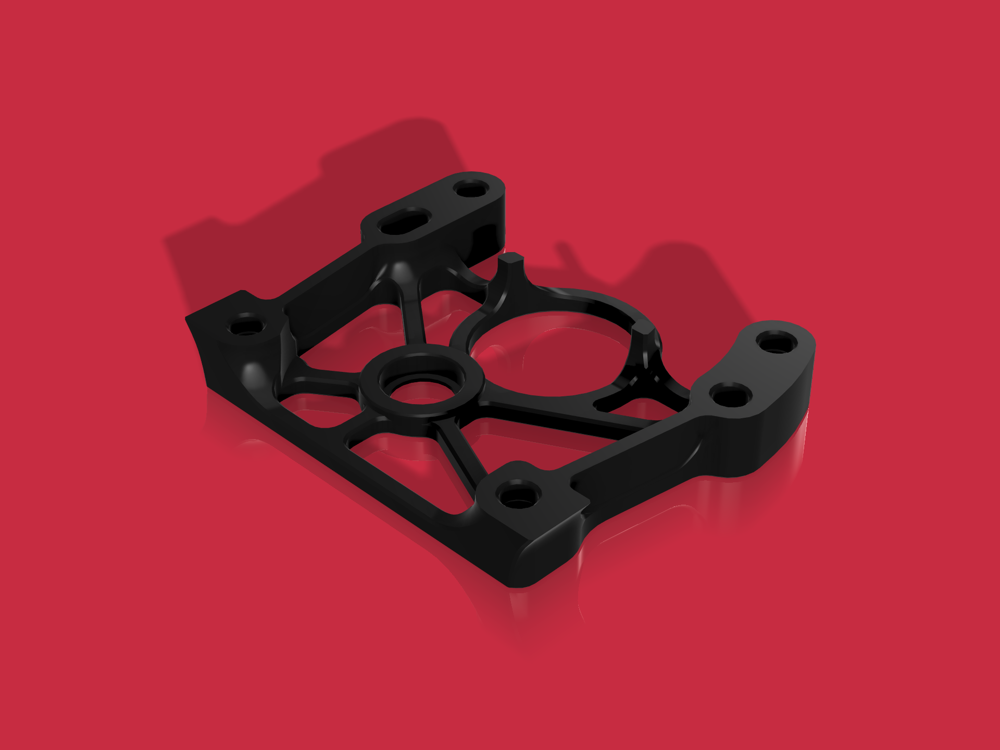

## Model origin
* Siggie Pop [Filament Sensor for Sherpa mini](https://www.printables.com/model/380317-filament-sensor-for-sherpa-mini)
* Orbiter Projects [Orbiter Filament Sensor](https://www.orbiterprojects.com/orbiter-filament-sensor/)

I only make small adjustment on "[rear_housing_sherpa_mini_for filament sensor.stl](https://www.printables.com/model/380317-filament-sensor-for-sherpa-mini/files#preview)" for 2 heat insert in the back since I have a problem with original model

