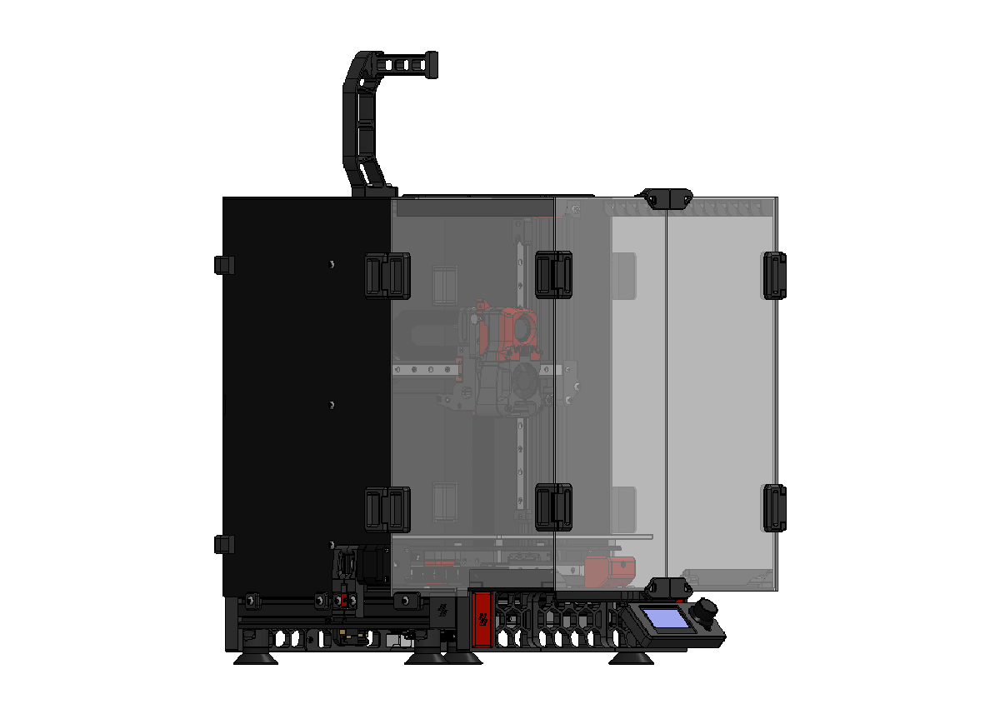
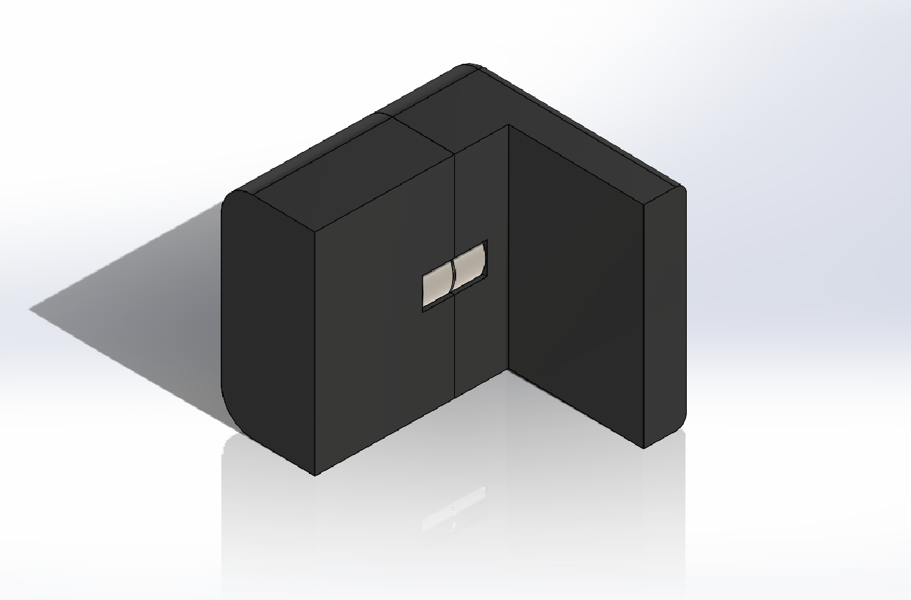
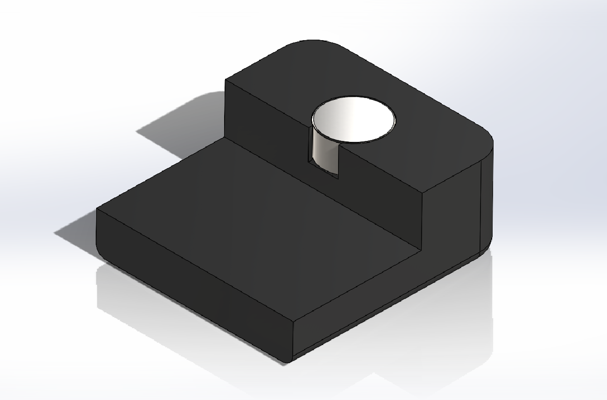
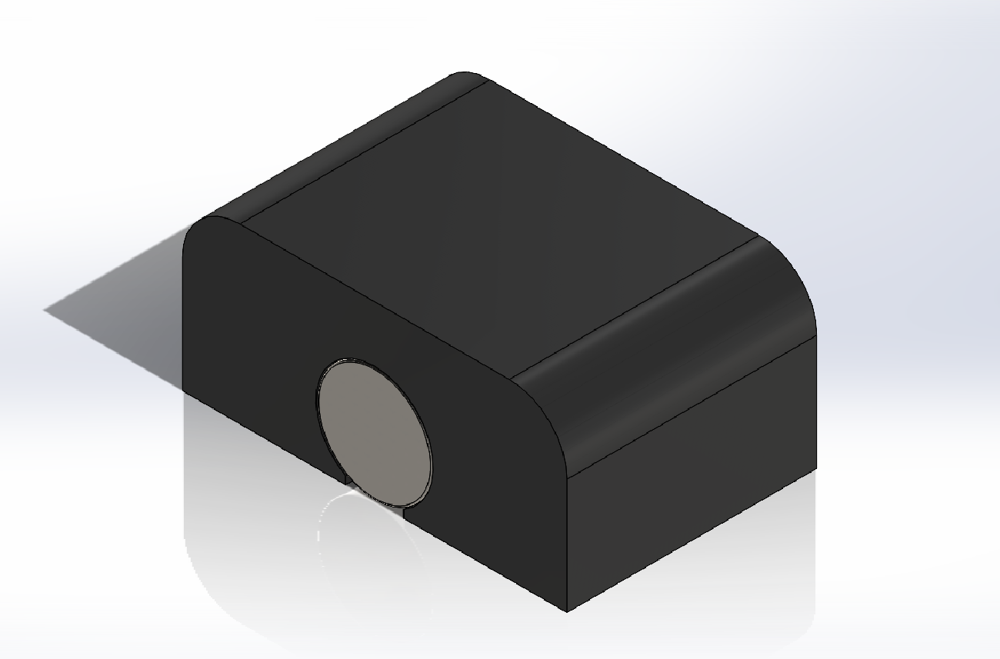

# Magnetic Back Panel

This mod allow for easy removal of back panel on [Official Voron Switchwire](https://github.com/VoronDesign/Voron-Switchwire) and [boubounokefalos Ender 3 Pro/V2 to Switchwire Conversion](https://github.com/boubounokefalos/Ender_SW).

## Printing
* Material: ABS, ABS+, ASA
* Layer Height: 0.2-0.3
* Infill: 20%-40%
* Supports: No

## BOM
  | Material | Qty |
  |-----|:----:|
  |6x3 Magnets|12|
  |CA Glue or Super Glue||
  |VHB Tape||

## Info
* you should remove rear_panel_bracket (5pcs) first.
* 4 pairs for both sides and 2 pairs more for top side.

## Assembly

