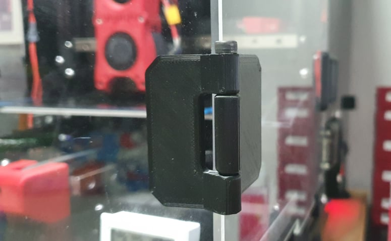

# Screw Hinge Door

This hinges allow for more degrees of motion, from closed to full open for both [Official Voron Switchwire](https://github.com/VoronDesign/Voron-Switchwire) and [boubounokefalos Ender 3 Pro/V2 to Switchwire Conversion](https://github.com/boubounokefalos/Ender_SW).

## Printing
* Material: ABS, ABS+, ASA
* Layer Height: 0.2-0.3
* Infill: 20%-40%
* Supports: No

## BOM
  | Part Description | Qty |
  |-----|:----:|
  |M4x50 SHCS|4 (for 2 pairs)|
  |VHB Tape||

## Info
* 2 pairs should be enough for both versions.
